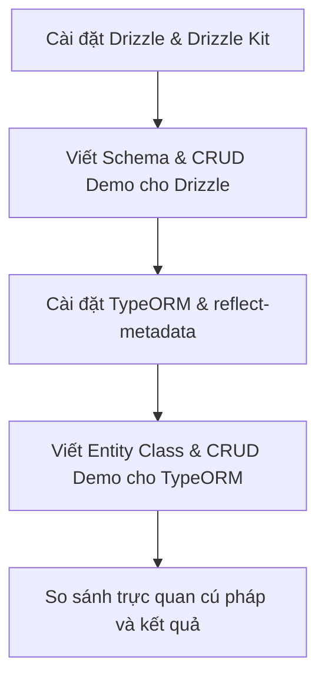

# Hướng Dẫn Tìm Hiểu & Học ORM (Drizzle ORM & TypeORM) Với SQLite

Tài liệu này được tạo ra để giúp bạn tìm hiểu về ORM (Object-Relational Mapping), so sánh hai thư viện ORM phổ biến là **Drizzle ORM** và **TypeORM**, đồng thời cung cấp lộ trình thực hành cụ thể trong dự án Desktop này.

---

## 1. Trả Lời Câu Hỏi: Dự Án Đã Có Index Chưa?

**Có, dự án đã có đầy đủ Indexes.**
Trong file [schema.js](file:///c:/Users/ADMIN/Documents/GitHub/APUS-student-management-test/students-management/src/main/local_database/schema.js#L47-L59), hệ thống đã tạo sẵn các chỉ mục (indexes) sau:
* **Bảng `Student`**: Index trên `student_code` (Unique), `full_name`, `email` (Unique), `class_name`, `major`, và `status`.
* **Bảng `Course`**: Index trên `course_code` (Unique) và `course_name`.
* **Bảng `Enrollment`**: Index trên `student_id`, `course_id`, và index phức hợp (composite index) `(student_id, course_id)` để đẩy nhanh tốc độ truy vấn liên kết sinh viên - môn học.

---

## 2. Tìm Hiểu Về ORM (Object-Relational Mapping)

### Khái niệm
ORM là một kỹ thuật lập trình giúp ánh xạ các bảng cơ sở dữ liệu quan hệ (SQL) thành các đối tượng (Objects/Classes) trong code JS/TS. Nó cho phép bạn tương tác với Database bằng cú pháp hướng đối tượng của JS/TS thay vì viết các câu lệnh SQL thô dưới dạng String.

### Tại sao nên dùng ORM?
1. **Lập trình an toàn và trực quan**: Sử dụng phương thức của JS/TS để thao tác dữ liệu (ví dụ: `db.insert(...)` hoặc `repo.save(...)`).
2. **Type Safety**: Khi dùng TypeScript, trình biên dịch sẽ cảnh báo ngay lập tức nếu bạn nhập sai tên cột, sai kiểu dữ liệu.
3. **Migrations (Quản lý phiên bản Database)**: Khi cần thay đổi cấu trúc bảng (thêm/sửa/xóa cột), ORM cung cấp các công cụ sinh file Migration tự động giúp đồng bộ database trên máy khách hàng mà không làm mất dữ liệu cũ.
4. **Bảo mật**: Mặc định bảo vệ ứng dụng khỏi các lỗi tấn công SQL Injection nhờ cơ chế chuẩn hóa tham số (parameterized queries).

---

## 3. So Sánh: Drizzle ORM vs TypeORM

### A. Drizzle ORM (Xu hướng hiện đại - Cực nhẹ & Type-Safe)
* **Triết lý**: *"If you know SQL, you know Drizzle ORM"*. Cú pháp rất gần gũi với SQL thô nhưng hoàn toàn type-safe.
* **Cơ chế**: Không che giấu hoạt động của SQL. Bạn chủ động viết các câu lệnh Query tương tự SQL.
* **Ưu điểm**:
  - Không có độ trễ runtime lớn (Zero-overhead).
  - Tốc độ thực thi cực kỳ nhanh (nhanh tương đương `better-sqlite3` thô).
  - Type-safe hoàn hảo bằng cách tự động suy luận kiểu (Type Inference) mà không cần viết quá nhiều Class/Decorator phức tạp.
  - Phù hợp hoàn hảo cho Electron vì bundle size rất nhỏ.
* **Nhược điểm**: Cộng đồng nhỏ hơn TypeORM (nhưng đang tăng trưởng rất nhanh).

### B. TypeORM (Enterprise-Grade - OOP phong cách Java/.NET)
* **Triết lý**: Thiết kế theo mô hình Hướng đối tượng (OOP). Sử dụng Class và Decorators (`@Entity`, `@Column`, `@ManyToOne`) để cấu hình bảng.
* **Cơ chế**: Che giấu hầu hết SQL bên dưới. Bạn làm việc hoàn toàn với các Object Instance của các Entity Class.
* **Ưu điểm**:
  - Đầy đủ tính năng nhất (matured, giàu tính năng).
  - Cộng đồng cực kỳ lớn, tài liệu phong phú.
  - Hỗ trợ tốt các framework OOP như NestJS.
  - Hỗ trợ cả 2 mẫu thiết kế phổ biến: *Active Record* và *Data Mapper (Repository)*.
* **Nhược điểm**:
  - Khởi động chậm hơn và nặng hơn (overhead runtime lớn hơn).
  - Cần cấu hình TypeScript Decorators phức tạp và thư viện `reflect-metadata`.

---

## 4. Kế Hoạch Thực Hành Học Tập

Chúng ta sẽ thực hiện việc học bằng cách thiết lập độc lập (không làm ảnh hưởng đến code gốc của ứng dụng) theo các bước:

### Bước 1: Setup Drizzle ORM
* Cài đặt: `drizzle-orm`, `drizzle-kit`.
* Khai báo schema tại một thư mục học tập riêng biệt.
* Viết code CRUD (Create, Read, Update, Delete) và chạy thử bằng Node.js để xem log câu lệnh SQL được sinh ra.

### Bước 2: Setup TypeORM
* Cài đặt: `typeorm`, `reflect-metadata`.
* Khai báo Entity Class cho `Student`, `Course`, `Enrollment`.
* Viết code CRUD và chạy thử.

### Bước 3: So sánh cú pháp và cơ chế Transaction
* So sánh cách viết transaction giữa Drizzle và TypeORM.
* Đánh giá xem ORM nào đem lại trải nghiệm lập trình tốt nhất cho dự án Desktop này.
